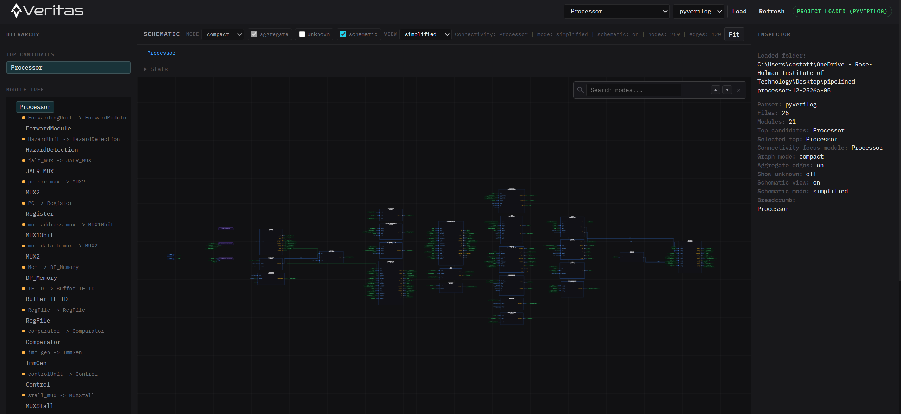

# rtl_arch_visualizer

Backend + API + browser UI for scanning and analyzing Verilog/SystemVerilog projects. The current build is focused on hierarchy exploration, module-level connectivity inspection, and schematic-style visualization of how signals move through a design.

Still deciding on the final project name: Verilogix, Inventio, Celeris, Verilium, or ArchRTL, Aegis, Nexus

## Current State Preview



## Current State

This is no longer just a "load RTL, print a tree" prototype. The project now has a reasonably complete scan -> parse -> model -> query -> visualize pipeline, with multiple ways to inspect the same module depending on how much detail you want.

Major capabilities in the current codebase:

- recursive `.v` / `.sv` project discovery with hidden-file and hidden-folder filtering
- two parser backends:
  - `pyverilog` for AST-based parsing
  - `simple` for regex-based fallback parsing
- normalized project model covering files, modules, ports, signals, instances, pin mappings, gate primitives, continuous assigns, and always blocks
- top-module inference and hierarchy tree generation
- module connectivity graphs in `compact` and `detailed` modes
- schematic rendering built from the connectivity graph with `full`, `simplified`, and `bus` routing modes
- width-aware signal metadata, bus classification, and directed-flow inference where possible
- compact-edge aggregation to reduce repeated parallel edges
- process-aware visualization for `always`, `always_ff`, `always_comb`, and `always_latch` blocks
- browser UI with hierarchy drill-down, breadcrumbs, graph stats, inspector panels, hover tooltips, signal tracing, and always-block detail overlays
- FastAPI endpoints for loading projects and querying hierarchy/connectivity data
- JSON export of parsed project data

## What Changed Since The Early MVP

The software has moved past the original "module hierarchy plus a basic graph" stage.

Notable additions and changes:

- connectivity is now modeled explicitly instead of only showing hierarchy relationships
- the graph builder now includes module I/O, instance pins, internal nets, gate primitives, continuous assigns, and collapsed process nodes
- the UI can switch between abstract graph views and routed schematic-style views
- process blocks are no longer opaque: the parsers extract read signals, written signals, control summaries, and assignment summaries
- port-level visualization is now first-class, which makes it easier to understand how a signal enters and leaves an instance or process
- schematic routing has multiple display modes so dense modules can be viewed either as a fuller routed drawing or a more compressed bus-centric summary
- edge aggregation and unknown-flow filtering were added to keep noisy modules readable
- the inspector and preview panels expose the graph metadata that the renderer is using, which helps with debugging and interpretation

## How The Main Features Work

### 1) Project Scanning

`app/scanner.py` walks a root folder recursively, ignores hidden files/folders, and keeps only `.v` and `.sv` files. The result is a deterministic file list that gets passed into the selected parser backend.

### 2) Parsing

The parser stage converts source files into a normalized `Project` dataclass model.

- `pyverilog` is the richer backend and the default option in the API/UI
- `simple` is a fallback backend that uses regex-based extraction when PyVerilog is unavailable or when AST coverage is not enough for a file

Both backends currently extract:

- module definitions
- ports and directions
- declared signals
- child instances and named pin mappings
- gate primitives
- continuous `assign` statements
- always blocks with assignment summaries and read/write signal summaries

The always-block extraction is one of the bigger improvements over the earlier version. Instead of only recording that a process exists, the code now collects which signals are read, which are written, and what assignments appear inside the process. That metadata is what powers the always-block overlay in the UI.

### 3) Service Layer

`app/project_service.py` is the orchestration layer used by the CLI and API. It is responsible for:

- loading a project
- returning sorted module names
- inferring top-module candidates
- generating hierarchy trees
- generating connectivity graphs
- switching between raw connectivity graphs and schematic-formatted output

This layer keeps the API thin. The UI asks for graphs with a few query parameters, and the service decides whether to build a compact/detailed connectivity graph or a routed schematic graph.

### 4) Connectivity Graphs

Connectivity graphs are built primarily in `app/graph_builder.py`.

There are two main modes:

- `compact`: shows endpoint-to-endpoint connections with less visual clutter
- `detailed`: inserts explicit net nodes so you can see parent-scope wiring more directly

The graph builder can include:

- module I/O nodes
- instance nodes
- instance port nodes
- net nodes
- gate nodes
- assign nodes
- collapsed always/process nodes
- process port nodes

Signal direction is inferred from module port direction, child-pin direction, and known write/read behavior where possible. If the builder cannot confidently determine direction, the edge is kept with `flow="unknown"` instead of guessing. That uncertainty is surfaced directly in the UI so the graph does not silently overclaim.

Compact mode also supports edge aggregation. When multiple nets connect the same endpoints, the builder can collapse them into one visual edge while preserving metadata such as the underlying net names and net count. This keeps repeated wiring patterns from overwhelming the view.

### 5) Schematic View

Schematic output is built in `app/schematic_layout.py`.

The schematic view is not a completely separate parser or data model. It starts from the compact connectivity graph, then applies block placement and route generation so the same connectivity information can be shown as a more hardware-like diagram.

Current schematic modes:

- `full`: more complete routed view
- `simplified`: lighter-weight routed view for readability
- `bus`: emphasizes grouped/bus-style signal presentation

Because the schematic is derived from the connectivity graph, improvements to parsing and connectivity inference automatically improve the routed view as well.

### 6) UI Interactions

The browser UI in `ui/` now supports a more complete inspection workflow:

- load a project from the preset project selector
- choose a parser backend
- browse inferred top modules
- drill through the hierarchy tree
- open module connectivity for the selected scope
- switch between graph modes and schematic modes
- aggregate edges or reveal unknown-flow edges
- inspect selected nodes/edges in the right-hand panel
- double-click an instance to navigate into the child module
- double-click a port to trace upstream and downstream signal paths
- double-click an always block to open a more detailed process summary overlay

The graph stats bar and JSON preview are also useful when debugging graph-builder behavior, since they show node/edge counts and a small sample of the payload the renderer received.

## API

The FastAPI app lives in `app/api.py`.

Main endpoints:

- `GET /api/health`
- `POST /api/project/load`
- `GET /api/project`
- `GET /api/project/tops`
- `GET /api/project/modules`
- `GET /api/project/modules/{module_name}`
- `GET /api/project/hierarchy/{top_module}`
- `GET /api/project/graph/{module_name}`
- `GET /api/project/connectivity/{module_name}`

Useful connectivity query parameters:

- `mode=compact|detailed`
- `aggregate_edges=true|false`
- `port_view=true|false`
- `schematic=true|false`
- `schematic_mode=full|simplified|bus`

When `schematic=true`, the API returns the routed schematic-style graph payload instead of the plain connectivity graph. When `port_view=true`, the graph includes explicit instance/process pin nodes so the UI can render boundary-aware connections.

## CLI Usage

From the repository root:

```bash
python -m app.main scan "C:\path\to\your\verilog-project"
```

Choose a parser backend:

```bash
python -m app.main scan "C:\path\to\your\verilog-project" --parser pyverilog
python -m app.main scan "C:\path\to\your\verilog-project" --parser simple
```

Write parsed project JSON:

```bash
python -m app.main scan "C:\path\to\your\verilog-project" --parser pyverilog --out out/project.json
```

Print the legacy hierarchy graph JSON when a single top module is inferred:

```bash
python -m app.main scan "C:\path\to\your\verilog-project" --parser pyverilog --graph
```

## Running The API And UI

Install runtime dependencies:

```bash
python -m pip install fastapi uvicorn pyverilog
```

If you do not want to install `pyverilog`, you can still use the `simple` parser backend.

Run the server:

```bash
python -m uvicorn app.api:app --reload
```

Open:

- UI: `http://127.0.0.1:8000/`
- API docs: `http://127.0.0.1:8000/docs`

Current UI note:

- the project selector in `ui/app.js` still uses hardcoded local paths rather than a general folder picker
- `ui/index.html` loads Cytoscape and ELK from CDNs

## Data Model

Defined in `app/models.py`.

- `SourceFile(path)`
- `Port(name, direction, width=None, bit_width=None, is_bus=False)`
- `Signal(name, width=None, kind="wire", bit_width=None, is_bus=False)`
- `PinConnection(child_port, parent_signal)`
- `Instance(name, module_name, connections, pin_connections)`
- `GatePrimitive(name, gate_type, output, inputs)`
- `ContinuousAssign(target, expression, source_signals)`
- `AlwaysAssignment(target, expression, condition, blocking, source_signals)`
- `AlwaysBlock(name, sensitivity, kind, process_style, assignments, control_summary, summary_lines, ...)`
- `ModuleDef(name, ports, signals, instances, gates, assigns, always_blocks, source_file)`
- `Project(root_path, source_files, modules)`

## Sample Projects

Bundled examples live under `sample_projects/`:

- `01_linear_chain`
- `02_serial_subsystem`
- `03_sensor_hub`
- `04_three_module_chain`

## Testing

Run the test suite:

```bash
python -m unittest discover -s tests -p "test_*.py"
```

Quick syntax checks commonly used during development:

```bash
python -m py_compile app/graph_builder.py app/project_service.py app/api.py app/schematic_layout.py
node --check ui/app.js
```

## Repository Layout

- `app/main.py`: CLI entry point
- `app/api.py`: FastAPI routes and UI serving
- `app/project_service.py`: orchestration service
- `app/scanner.py`: file discovery
- `app/models.py`: core dataclasses
- `app/parser_base.py`: parser backend interface
- `app/pyverilog_parser.py`: AST parser backend
- `app/simple_parser.py`: regex fallback parser
- `app/hierarchy.py`: top inference and hierarchy tree
- `app/graph_builder.py`: hierarchy and connectivity graph builders
- `app/schematic_layout.py`: schematic placement and routing
- `app/json_exporter.py`: project JSON export
- `ui/index.html`, `ui/styles.css`, `ui/app.js`: browser client
- `tests/`: unit tests
- `sample_projects/`: bundled RTL examples
- `out/`: generated output files
- `artifacts/`: debug logs and summaries

## Known Limitations

- this is not a full elaborating Verilog/SystemVerilog compiler
- advanced SystemVerilog coverage is still incomplete
- some direction inference is still heuristic, so unknown-flow edges can remain
- very dense modules can still become visually busy even with aggregation/schematic routing
- the UI project picker is still preset-path based rather than a true filesystem browser
- the UI is browser-served, not packaged as a desktop application

## Generated Files

Do not commit generated parser/cache artifacts.

- `parsetab.py`
- `parser.out`
- `__pycache__/`
